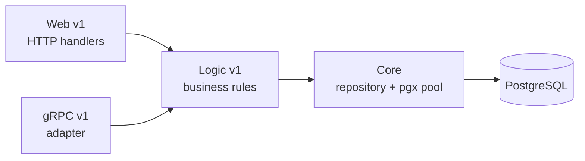

# AGENTS.md

Agent-focused guide for `notification-service`. Read this before making changes.

## Contribution workflow for AI agents

- Never push to `main`. Branch first, then open a PR and let CI gate the merge.
- Use conventional branch prefixes: `feat/`, `fix/`, `docs/`, `chore/`, `refactor/`.
- Commits use a Conventional Commits prefix. Subject is imperative, capitalised,
  no trailing period.
- Do not add attribution trailers (`Signed-off-by`, `Co-authored-by`,
  `Assisted-by`, `Generated-by`, etc.).
- No GitHub issue references (`Fixes #123`) and no `@`-mentions in commit messages;
  put context in the PR description instead.
- One logical change per PR. PRs are merged via squash, so keep the branch focused.

## Code quality

- All code MUST pass `golangci-lint run` before commit. CI's `go-check` job blocks
  merges on lint errors. Config is `.golangci.yml` (v2+, 60+ linters).
- Always check error returns; use `_ = fn()` only when discarding is deliberate.
- Use `errors.New()` over `fmt.Errorf()` when there are no format verbs (`perfsprint`).
- Use `net.JoinHostPort()` instead of `fmt.Sprintf("%s:%s", host, port)`
  (`nosprintfhostport`).
- Use `http.NewRequestWithContext()` instead of `http.NewRequest()` (`noctx`).
- Extract repeated string literals to constants (`goconst`); extract helpers to
  reduce cognitive complexity (`gocognit`).
- Add tests for new behaviour. Keep changes surgical — match existing style, do
  not refactor unrelated code.
- Before pushing or opening a PR, verify Sonar new-code coverage ≥80%: run
  `go test -race -coverprofile=coverage.out ./...` and confirm changed lines are
  covered, including BOTH branches of any new conditional. `**/cmd/**`,
  `**/db/migrations/**`, `**/core/repository/**` are coverage-excluded;
  everything else counts.

## Project overview

`notification-service` is the notification microservice for the `duynhlab`
platform. It handles email, SMS, and in-app notifications.

- Module: `github.com/duynhlab/notification-service`
- Go: 1.26 (`GOTOOLCHAIN=auto` lets the toolchain auto-upgrade as pinned in `go.mod`)
- Serves two transports: **HTTP `:8080`** (browser `private` + in-cluster
  `internal` routes) and **gRPC `:9090`** (east-west, always on).

## Repository layout

- `cmd/main.go` — wiring: HTTP + gRPC servers, DI, graceful shutdown.
- `config/config.go` — env-based config (`Load` + `Validate`).
- `internal/web/v1/handler.go` — HTTP handlers (Gin), JSON binding, DTO mapping.
- `internal/logic/v1/` — business rules (`service.go`) and sentinel errors
  (`errors.go`).
- `internal/grpc/v1/server.go` — gRPC adapter over the logic layer (mirrors `web/v1`).
- `internal/core/` — domain + persistence:
  - `core/domain/` — domain models and the repository interface.
  - `core/notification_repository.go` — repository implementation (all SQL lives here).
  - `core/database.go` — pgx/v5 pool (`Connect` / `GetPool`).
- `middleware/` — tracing, logging, prometheus, profiling, resource middleware.
- `config/` — config loading and validation.
- `db/migrations/` — golang-migrate SQL (`sql/000001_*.up.sql`), embedded via `embed.go` (`embed.FS`).

## Build, test, lint

```bash
GOTOOLCHAIN=auto go build ./...   # verify compilation
GOTOOLCHAIN=auto go vet ./...     # static checks
GOTOOLCHAIN=auto go test ./...    # run tests
golangci-lint run                 # lint — MUST pass
```

Run `go mod tidy` after changing dependencies.

### Testing conventions

- **Unit tests** — stdlib `testing` only (no testify/gomock), hand-written mocks for
  interfaces, table-driven subtests, in `*_test.go` next to the code: Web (`httptest`),
  Logic (pure — mock the repo), gRPC (call handlers directly), `middleware`, `config`. Run
  with `go test ./...` (no Docker).
- **Integration tests** — `internal/core/repository` is tested against a **real Postgres**
  via testcontainers, build-tagged `//go:build integration` (the default `go build`/`go test`
  skip them, so the binary never links testcontainers). Run locally with Docker:
  `go test -tags=integration ./internal/core/repository/...`. CI wires `integration: true`
  (go-check) + `integration-coverage: true` (sonar), and merges both coverage profiles into
  the ≥ 80% new-code gate.
- **Before pushing**, both the unit run *and* the integration suite must be green locally —
  green unit ≠ green CI (CI also runs integration with Docker).

## Conventions

### 3-layer architecture (Web → Logic → Core)

Dependency flows one way only: Web → Logic → Core. Core imports nothing from
Web or Logic.

| Layer | Location | Responsibility | Forbidden |
|-------|----------|----------------|-----------|
| Web | `internal/web/v1/` | HTTP handling, validation, DTO mapping, call Logic | SQL, direct DB, business rules |
| gRPC | `internal/grpc/v1/` | gRPC adapter → Logic (mirrors Web) | SQL, direct DB, business rules |
| Logic | `internal/logic/v1/` | Business rules, call repository interfaces, domain errors | SQL, `database.GetPool()`, `*gin.Context` |
| Core | `internal/core/` | Domain models, repository interface (`core/domain/`) + impl (`core/notification_repository.go`), pgx pool (`core/database.go`) | HTTP handling, business orchestration |

Both the Web and gRPC layers call the **same** `logic/v1` service.



### gRPC: server only

This service runs a gRPC **server** built on shared `pkg/grpcx` (OpenTelemetry
interceptors, health, reflection).

- **Server** — exposes `notification.v1.NotificationService/SendEmail` (and
  `SendSMS`) on `:9090`. `SendEmail` is called best-effort by `order-service` on
  checkout. Impl in `internal/grpc/v1/server.go`.
- No gRPC client: JWTs are verified locally via the shared `pkg/authmw` JWKS
  verifier against the Keycloak realm (`OIDC_ISSUER`) — no per-request call to
  an identity service.

### API endpoints

Routes mount directly at `/{service}/v1/{audience}/…` (Variant A — single URL
shape). Kong is pure pass-through for `private`; `internal` is reachable only via
in-cluster service DNS.

| Method | Path | Audience |
|--------|------|----------|
| `GET` | `/notification/v1/private/notifications` | private |
| `GET` | `/notification/v1/private/notifications/count` | private |
| `PATCH` | `/notification/v1/private/notifications/read-all` | private |
| `GET` | `/notification/v1/private/notifications/:id` | private |
| `PATCH` | `/notification/v1/private/notifications/:id` | private |
| `POST` | `/notification/v1/internal/notifications/email` | internal |
| `POST` | `/notification/v1/internal/notifications/sms` | internal |

Full inventory: [`homelab/docs/api/api-naming-convention.md`](https://github.com/duynhlab/homelab/blob/main/docs/api/api-naming-convention.md).

### Observability

Uses shared `github.com/duynhlab/pkg/obsx`.

- `obsx.SetupMetrics()` (called in `main` before the gRPC server) puts gRPC RED
  metrics (`rpc_server_*`, `rpc_client_*`) on the **existing** `/metrics` endpoint
  via the shared Prometheus registry — no separate port. HTTP RED metrics come
  from `middleware/prometheus.go` on the same endpoint, with trace exemplars.
- `middleware/logging.go` uses `obsx.TraceIDFromContext` so log `trace_id`
  correlates with exported traces.
- Tracing: OpenTelemetry → OTLP HTTP (OTel Collector). Profiling: Pyroscope.
- Middleware chain order: tracing → logging → metrics.

### Database

| Component | Value |
|-----------|-------|
| Cluster | supporting-db (shared with user, shipping) |
| PostgreSQL | 16 |
| Pooler | PgBouncer sidecar, transaction mode |
| Endpoint | `supporting-db-pooler.user.svc.cluster.local:5432` |

Cluster lives in the `user` namespace; the Zalando Operator syncs credentials via
a cross-namespace secret. pgx/v5 uses the simple protocol (no statement cache) so
it is pooler-safe.

### Diagrams

Use Mermaid for all diagrams. Never use ASCII art.

## Gotchas and non-obvious rules

- The gRPC server impl (`internal/grpc/v1/server.go`) is a transport peer that
  calls the logic layer — it must never touch the DB directly (no SQL, no
  `database.GetPool()`).
- Kyverno admission rejects images tagged `:latest`. Use
  `ghcr.io/duynhlab/notification-service:<sha>` or `:vX.Y.Z`.
- Migrations run via golang-migrate v4.19.1 (`pkg/migratex`), embedded and applied
  from the `migrate` subcommand; the init container reuses the app image
  (`args: ["migrate"]`). Migrations are forward-only (`.up.sql`).
- Graceful shutdown follows the VictoriaMetrics pattern: `/ready` → 503, drain
  delay (5s), then shut down HTTP → Database → Tracer in order.
